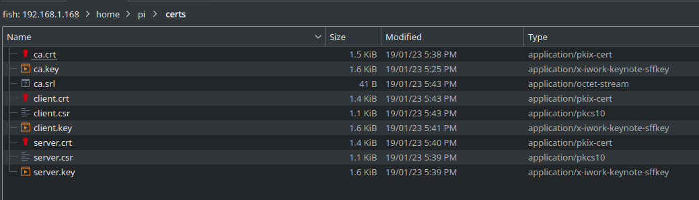
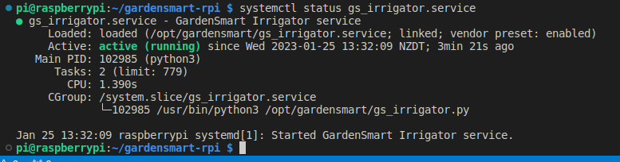
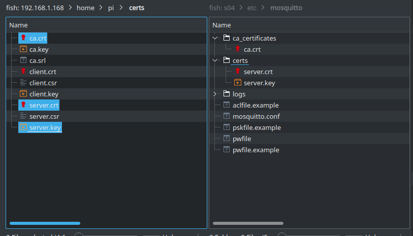

# gardensmart-rpi
Garden Smart Raspberry Pi MQTT based service for turning on watering irrigators and receiving sensor data such as flow rate, temperature, etc.

** NOTE: There is an accompanying guide that will be found here once available. **


## Setup the Irrigation Controller Service.

1. Download and install Raspian Bullseye following the instructions here.
https://www.raspberrypi.com/documentation/computers/getting-started.html

2. Once the Raspberry Pi is up and running, setup the Raspberry Pi and enable the Raspbian I2C software interface.
```
$ sudo raspi-config
```
3. Install our dependencies
```
sudo apt install git build-essential libdbus-1-dev sqlite3 libsqlite3-dev libssl-dev python3-pip
```
```
sudo pip3 install smbus flask paho-mqtt
```
```
sudo dpkg-reconfigure ca-certificates
```
4. On the Raspberry Pi, create a place to store and create our self signed certificates that we will use here and with our clients. Keep this folder safe and secure as we will need this folder later.
```
$ mkdir ~/certs
$ cd ~/certs
```
5. Create our Certificate Authority (CA) key file.
```
$ openssl genrsa -out ca.key 2048
```
6. Now create our CA certificate
```
$ openssl req -new -x509 -days 9999 -key ca.key -out ca.crt
```
7. Enter your certificate details.
```
Country Name (2 letter code) [AU]:NZ
State or Province Name (full name) [Some-State]:Canterbury
Locality Name (eg, city) []:Christchurch
Organization Name (eg, company) [Internet Widgits Pty Ltd]:Kultivator Consulting Ltd
Organizational Unit Name (eg, section) []:GardenSmart
Common Name (e.g. server FQDN or YOUR name) []:GardenSmart
Email Address []:name@example.com
```
8. Create the server key
```
openssl genrsa -out server.key 2048
```
9. Create our server certificate request
```
openssl req -new -out server.csr -key server.key
```
```
Enter your server certificate details.
Country Name (2 letter code) [AU]:NZ
State or Province Name (full name) [Some-State]:Canterbury
Locality Name (eg, city) []:Christchurch
Organization Name (eg, company) [Internet Widgits Pty Ltd]:Kultivator Consulting Ltd
Organizational Unit Name (eg, section) []:MQTT Broker
Common Name (e.g. server FQDN or YOUR name) []:mqtt.example.com
Email Address []:name@example.com

Please enter the following 'extra' attributes
to be sent with your certificate request
A challenge password []:
An optional company name []:
```
**NOTE: Make sure the Common Name matches your host DNS record for your server.**

10. Now create our server certificate.
```
$ openssl x509 -req -in server.csr -CA ca.crt -CAkey ca.key -CAcreateserial -out server.crt -days 9999
```
11. Create the irrigator & app client key
```
$ openssl genrsa -out client.key 2048
```
12. Create our client certificate request
```
$ openssl req -new -out client.csr -key client.key
```
13. Enter your client certificate details.
```
Country Name (2 letter code) [AU]:NZ
State or Province Name (full name) [Some-State]:Canterbury
Locality Name (eg, city) []:Christchurch
Organization Name (eg, company) [Internet Widgits Pty Ltd]:Kultivator Consulting Ltd
Organizational Unit Name (eg, section) []:MQTT Client
Common Name (e.g. server FQDN or YOUR name) []:GardenSmartClient
Email Address []:name@example.com

Please enter the following 'extra' attributes
to be sent with your certificate request
A challenge password []:
An optional company name []:
```
14. Now create our client certificate.
```
$ openssl x509 -req -in client.csr -CA ca.crt -CAkey ca.key -CAcreateserial -out client.crt -days 9999
```
15. Your 'certs' folder should contain something like this.


16. Clone the 'gardensmart-api' (this) repository to your Raspberry Pi, '/home/pi/'.
```
$ git clone https://github.com/KultivatorConsulting/gardensmart-rpi.git
```
17. Configure your irrigation zones and gardens by modifying the etc/gardensmart.config.json file. 'relayId' is the relay index as defined by the relay module for that irrigator valve. 'flowRateGpioPin' is the GPIO pin for the input from the flow rate sensors for that irrigator valve.
```
  "irrigatorService": {
    "zones": [
      {
        "id": 0,
        "name": "Vegetable Garden",
        "garden": "Backyard",
        "description": "Raised vegetable patches.",
        "relayId": 1,
        "flowRateGpioPin": 0
      },
      {
        "id": 1,
        "name": "Citrus Gardens",
        "garden": "Backyard",
        "description": "Lemon tree and gardens alongside the office.",
        "relayId": 2,
        "flowRateGpioPin": 0
      },
      {
        "id": 2,
        "name": "Fruit Garden",
        "garden": "Backyard",
        "description": "Back garden fruiting bushes.",
        "relayId": 3,
        "flowRateGpioPin": 0
      },
      {
        "id": 3,
        "name": "Backyard Lawn",
        "garden": "Backyard",
        "description": "Backyard lawns.",
        "relayId": 4,
        "flowRateGpioPin": 0
      }
    ]
  }
```
18. Configure your certificates and authentication for the MQTT client.

**NOTE: Remember to save this password somewhere safe as you will need it when setting up the Mosquitto MQTT Broker below. Use a good password generator app.**

```
  "broker": {
    "host": "s04.kultivator.net.nz",
    "port": 8883,
    "username": "irrigator",
    "password": "a_good_password",
    "clientId": "python-mqtt-0",
    "caCerts": "/opt/gardensmart/certs/ca.crt",
    "certFile": "/opt/gardensmart/certs/client.crt",
    "keyFile": "/opt/gardensmart/certs/client.key"
  },
```
19. Install and enable the service via systemd.
```
$ sudo ./install.sh
$ sudo systemctl enable gs_irrigator.service
```
20. Copy the Certificate Authority certificate, the client certificate and the client key to our service.
```
$ sudo cp /home/pi/certs/ca.crt /opt/gardensmart/certs/ca.crt
$ sudo cp /home/pi/certs/client.crt /opt/gardensmart/certs/client.crt
$ sudo cp /home/pi/certs/client.key /opt/gardensmart/certs/client.key
```
21. Start our RPI irrigator service and confirm that it running.
```
$ sudo systemctl start gs_irrigator.service
$ systemctl status gs_irrigator.service
```


22. View the logs and make sure the service is connected to the MQTT broker.
```
$ cat /opt/gardensmart/log/gardensmart.log
2023-01-22 16:03:37,565 gardensmart_irrigatorService INFO     MainProcess Started GardenSmart Irrigator Service Logger
2023-01-22 16:03:37,568 gardensmart_irrigatorService INFO     MainProcess Opened database successfully
2023-01-22 16:03:37,637 gardensmart_irrigatorService DEBUG    MainProcess Sending CONNECT (u1, p1, wr0, wq0, wf0, c1, k60) client_id=b'python-mqtt-0'
2023-01-22 16:03:37,643 gardensmart_irrigatorService DEBUG    MainProcess Received CONNACK (0, 0)
2023-01-22 16:03:37,644 gardensmart_irrigatorService INFO     MainProcess Connected to MQTT Broker!
2023-01-22 16:03:37,645 gardensmart_irrigatorService DEBUG    MainProcess Sending SUBSCRIBE (d0, m1) [(b'/gardensmart/commands', 0)]
2023-01-22 16:03:37,646 gardensmart_irrigatorService DEBUG    MainProcess Sending SUBSCRIBE (d0, m2) [(b'/gardensmart/zones/irrigators', 0)]
2023-01-22 16:03:37,652 gardensmart_irrigatorService DEBUG    MainProcess Received SUBACK
2023-01-22 16:03:37,653 gardensmart_irrigatorService INFO     MainProcess Subscribed to MQTT Broker!
2023-01-22 16:03:37,655 gardensmart_irrigatorService DEBUG    MainProcess Received SUBACK
2023-01-22 16:03:37,656 gardensmart_irrigatorService INFO     MainProcess Subscribed to MQTT Broker!
```


## Setup a public Mosquitto MQTT Broker server.

Use a VPS and create a Redhat and Centos Linux virtual machine. Here in New Zealand I am using Voyager Virtual Server (https://voyager.nz/business/hosting/virtual-servers) but you can use what ever service you want. You could always setup your broker locally on your LAN however you would not be able to control your garden from outside your home without introducing some additional security considerations.

1. SSH into your server and install Mosquitto
```
$ sudo yum -y install epel-release
$ sudo yum -y install mosquitto
$ sudo systemctl start mosquitto
$ sudo systemctl enable mosquitto
```

2. Confirm your new MQTT broker is running. Make sure it says 'loaded' and 'active'.
```
$ sudo systemctl status mosquitto
```

3. Secure the server.
```
$ sudo systemctl stop mosquitto
$ sudo rm /etc/mosquitto/mosquitto.conf
$ sudo vi /etc/mosquitto/mosquitto.conf
```

Paste the following into the empty config file;
```
# Logging
log_dest syslog
log_type all
log_timestamp true

# Authentication
allow_anonymous false
password_file /etc/mosquitto/pwfile
use_identity_as_username true

# TLS
port 8883
cafile /etc/mosquitto/ca_certificates/ca.crt
keyfile /etc/mosquitto/certs/server.key
certfile /etc/mosquitto/certs/server.crt
tls_version tlsv1.2

# Client TLS
require_certificate true
```
4. Add our first client users.
```
$ mosquitto_passwd -c /etc/mosquitto/pwfile irrigator
$ mosquitto_passwd -b /etc/mosquitto/pwfile irrigator a_good_password

$ mosquitto_passwd -c /etc/mosquitto/pwfile app
$ mosquitto_passwd -b /etc/mosquitto/pwfile app another_good_password
```
**NOTE: Remember to use the password you created above.**

5. Copy the following files from the section 'Setup the Irrigation Controller Service.' above to Mosquitto using SCP or Putty.


6. Start the MQTT broker and confirm it is running as expected. Check the logs if you see it has not started after a few moments.
```
$ sudo systemctl start mosquitto
$ sudo systemctl status mosquitto
```
7. Add port 8883 to the firewall.
```
$ sudo firewall-cmd --permanent --add-port=8883/tcp
$ sudo firewall-cmd --reload
```
8. Test our new configuration;
```
$ mosquitto_pub -h mqtt.example.com -t test -m "hello" -p 8883 --cafile /etc/mosquitto/ca_certificates/ca.crt -u "irrigator" -P "a_good_password"
```
Make sure you use the correct hostname for your broker as used for the Common Name when we created the certificate.


